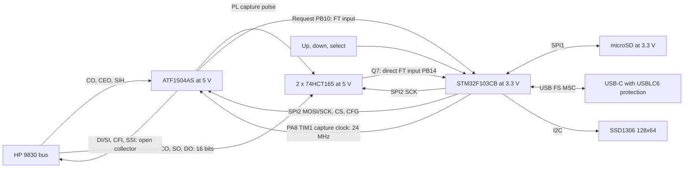

# Proposed hardware

| ID | Hardware requirement |
| --- | --- |
| HW-001 | Use the 5 V **AS** family. Do not substitute a low-voltage family on the assumption that it has the same electrical interface. |
| HW-002 | HP-facing DI0..7, SI0..3, CFI and SSI shall only sink current or release. Disable pin keepers and pull-ups on these CPLD pins. |
| HW-003 | Validate per-pin VOL/current, total simultaneous sink current, ground-current limits, thermal load and release rise time before direct connection. |
| HW-004 | Account for combined CPLD + HCT165 loading on CO; all circuitry on each HP output shall remain within the reference's one standard TTL input load constraint. |
| HW-005 | Run the 74HCT165 pair from 5 V. Use PB14/PB10 FT inputs directly for MISO/request, subject to the powered-supply/reset checks in issue 026. Disable their internal pulls. MCU outputs may drive TTL-threshold inputs if worst-case margins pass. |
| HW-006 | Separate SPI2 (HP link) from SPI1 (SD). Never clock the HP input chain for SD transactions. |
| HW-007 | Provide a continuous 24 MHz PA8 TIM1_CH1 capture clock, hardware reset, default-low HP_RUN, CPLD JTAG and MCU SWD access. Hold the CPLD reset until its clock is stable at startup; keep the clock running and RESET_n released during MSC. |
| HW-008 | Prevent USB VBUS from feeding the HP 5 V rail and prevent an unpowered MCU/CPLD from being back-powered through signals. |
| HW-009 | Reuse J1 assignments, pad sides and geometry from the current KiCad schematic/PCB, as extracted in 06_existing_connector.md. Keep the older .sch numbering separate; check physical fit/orientation before production. |
| HW-010 | Feed the board from HP bus power and USB VBUS through one Schottky diode per source, with common cathodes. Verify rail headroom and peak-current capability after the diode drop. |
| HW-011 | Use an SD socket with active-low card detect on PB4; debounce in firmware. |
| HW-012 | Reserve PA9/PA10 for USART1 debug; provide J5 ordered +3.3 V, TX, RX, GND. |
| HW-013 | Place CPLD/HCT165s beside the HP connector and reuse its current symbol/footprint; start an unrouted placement for routing review. |
| HW-014 | Use DECPROMEM-style inline VHDL pin constraints, fixed preassignment, retained JTAG and a pin/net cross-check. |
| HW-015 | Use USB-C and the source S15 USBLC6 protection circuit, including separate CC pull-downs. |

The CPLD uses 29 logical signal pins: six HP inputs plus the capture clock, reset and
HP_RUN, four SPI/control inputs, two MCU/input-register outputs, and fourteen
HP outputs. The capture clock, SPI SCK and CS flag strobe use the three global clock resources.
The 44-pin device has 36 signal positions including four dedicated input positions;
retaining four JTAG pins leaves 32 for the design. The simplified implementation
fits with all 29 pins retained; the inline map, schematic and PCB agree. Fitter
resource-accounting review remains in 029, and physical timing/electrical checks
remain necessary before manufacture.

The user chooses 24 MHz from STM32 PA8, replacing the HP MCK clock proposal.
According to [RM0008](https://www.st.com/resource/en/reference_manual/cd00171190-stm32f101xx-stm32f102xx-stm32f103xx-stm32f105xx-and-stm32f107xx-advanced-arm-based-32Bit-mcus-stmicroelectronics.pdf),
MCO selects PLL/2 rather than an arbitrary divisor: a 72 MHz PLL gives 36 MHz.
Use PA8's TIM1_CH1 PWM with a 72 MHz timer clock, PSC=0, ARR=2 and CCR1=1.
The derived period is 41.7 ns, HIGH is 13.9 ns and LOW is 27.8 ns: the approximately
40 ns figure is a period, not a HIGH pulse. Check those pulse widths against the
chosen CPLD. Keep the timer running during service and MSC. The VHDL bench now uses this
24 MHz waveform and checks the two-cycle PL pulse; issue 005 retains physical
clock/capture timing and reset-recovery validation.

The HCT165s still use SPI2 SCK for shifting; PA8 clocks the CPLD capture logic.
With the two load states, PL LOW is nominally 83.3 ns. Nexperia's
S09 HCT table specifies minimum PL LOW of 30 ns and Dn-to-PL setup of 30 ns at
4.5 V across -40..125 C, so shortening the clock alone does not establish HP
data-hold compatibility. Check actual input stability, PL-to-shift recovery and
direct-input and CPLD delays. The continuous clock and PL are different signals.

HCT165 wiring: lower chip D0..D7 = DO0..DO7, upper chip D0..D3 = SO0..SO3,
upper D4..D7 = CO0..CO3. Lower Q7 goes to upper DS; lower DS is grounded.
Upper **non-inverting** Q7 feeds PB14 directly. Both clock-enable pins
are low, CP uses SPI2 SCK, and both PL pins share the CPLD's input_pl_n pulse.
Capturing the actual select code saves three CPLD pins otherwise needed to put
device-identification signals into the input register. nGP/nTP/nPR exist internally.

The [package pin map](08_pin_mapping.md) assigns HP SPI2 to PB13/PB14/PB15
and PB12 CS, with PB14 as the direct FT MISO input. SD instead uses SPI1 on
PA5/PA6/PA7 and PA4 CS, entirely at 3.3 V. This avoids the reset-state JNTRST
pull-up on the earlier PB4 HP-MISO proposal. PB10 is the FT request input;
PB0/PB11 are now spare after removing COMMIT and overrun.
Reserve PA9/PA10 for USART1 on J5 (+3.3 V, TX, RX, GND); PA3 receives divided
VBUS sense and PB5 controls the external USB pull-up. Card detect uses PB4
at 3.3 V; disable JTAG while retaining SWD. No SPI remap is required.
The complete LQFP48/PLCC44 tables and initialization requirements are in
08_pin_mapping.md.

Direct FT wiring is provisional during power-up/reset: FT voltage limits depend
on VDD, internal pulls must be disabled above VDD+0.3 V, and powered-state tolerance does not establish power-off compatibility. Issue 026 checks rail ramps, reset and fault conditions,
including the VBUS divider. Add isolation if this cannot be made safe; the
powered-state FT rating alone does not establish power-off compatibility.

The three-sheet KiCad draft reuses the current HP connector symbol and embedded
footprint. CPLD and HCT165s sit beside the connector; MCU is to their right.
USB-C reuses the HRO-TYPE-C-31-M-12 connector and USBLC6-2SC6 protection from
source S15, including 22 Ohm data resistors, two 5.1 kOhm CC resistors,
1.5 kOhm switched D+ pull-up and the 1.8 kOhm / 3.3 kOhm VBUS divider.
An additional 10 kOhm pull-down defaults the PB5-controlled USB pull-up off.
USBLC6 connects to raw VBUS. See [the KiCad notes](../hardware/rev2/kicad/README.md).

The CB medium-density part has no SDIO; use SPI for SD. Its stated RAM is 20 KiB
and flash 128 KiB. Capacity must be verified with the real Arduino/SdFat/USB/UI build.
MCU pin functions are based on [ST's datasheet](00_sources.md#sources-and-evidence)
and must be checked again when the package and schematic are fixed.

For each HP input line calculate:

`I_sink = (V_pullup_max - VOL_target) / R_pullup_min + sum(receiver IIL_max)`.

Use the user's 1 kOhm DI/SI/CFI/SSI value from Tony Duell's schematic. At nominal 5 V it
contributes roughly 5 mA per line before receiver loading; add tolerances and
simultaneous sinks. Fourteen nominal pull-ups contribute approximately 70 mA if
all lines sink together, before receiver loading. Verify VOL and rise time
under actual loading. External bus drivers are needed only if direct drive fails.

The two Schottky input diodes are an accepted power-source choice. The supply
budget must include their forward drop. The reviewed
[CPLD datasheet](https://ww1.microchip.com/downloads/en/DeviceDoc/Atmel-0950-CPLD-ATF1504AS(L)-Datasheet.pdf)
specifies minimum 4.75 V for commercial or 4.50 V for industrial operation.
The user requires the CPLD to remain powered without asserting RESET_n during
MSC; HP_RUN stays low to release every HP output and clear pending flags/requests.
Keep TIM1 running. Issue 022 therefore requires the rail budget to pass in both
power modes; the MCU's 3.3 V supply needs its own regulator budget.

The HP21xx reference schematic S15 specifies 1N5819WS power diodes and a
TLV75533 3.3 V regulator. Reusing its source-isolation topology does not establish
the margin for this CPLD: as an illustrative calculation, 5.0 V minus a 0.3 V
forward drop is 4.7 V, below the commercial CPLD minimum. The example drop is not
a measured or guaranteed value for the reference diode. The draft chooses the industrial ATF1504AS-10JU44; validate its margin and
the diode from a budget using minimum source voltage and worst-case forward
drop at the actual load/temperature. A larger current rating alone is insufficient.
