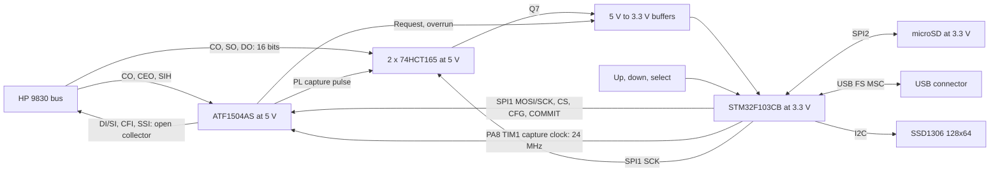

# Proposed hardware

| ID | Hardware requirement |
| --- | --- |
| HW-001 | Use the 5 V **AS** family. Do not substitute a low-voltage family on the assumption that it has the same electrical interface. |
| HW-002 | HP-facing DI0..7, SI0..3, CFI and SSI shall only sink current or release. Disable pin keepers and pull-ups on these CPLD pins. |
| HW-003 | Validate per-pin VOL/current, total simultaneous sink current, ground-current limits, thermal load and release rise time before direct connection. |
| HW-004 | Account for combined CPLD + HCT165 loading on CO; all circuitry on each HP output shall remain within the reference's one standard TTL input load constraint. |
| HW-005 | Run the 74HCT165 pair from 5 V. Translate MISO and MCU-facing CPLD outputs to 3.3 V. MCU outputs may drive TTL-threshold inputs if the actual worst-case margins pass. |
| HW-006 | Separate SPI1 (HP link) from SPI2 (SD). Never clock the HP input chain for SD transactions. |
| HW-007 | Provide a continuous 24 MHz PA8 TIM1_CH1 capture clock, hardware reset, default-low HP_RUN, CPLD JTAG and MCU SWD access. Hold the CPLD reset until its clock is stable at startup; keep the clock running and RESET_n released during MSC. |
| HW-008 | Prevent USB VBUS from feeding the HP 5 V rail and prevent an unpowered MCU/CPLD from being back-powered through signals. |
| HW-009 | Reuse J1 assignments, pad sides and geometry from the current KiCad schematic/PCB, as extracted in 06_existing_connector.md. Keep the older .sch numbering separate; check physical fit/orientation before production. |
| HW-010 | Feed the board from HP bus power and USB VBUS through one Schottky diode per source, with common cathodes. Verify rail headroom and peak-current capability after the diode drop. |
| HW-011 | Use an SD socket with a card-detect contact wired to an MCU GPIO; define its polarity and debounce. |

The CPLD uses 31 logical signal pins: six HP inputs plus the capture clock, reset and
HP_RUN, five SPI/control inputs, three MCU/input-register outputs, and fourteen
HP outputs. The capture clock, SPI SCK and COMMIT should use the three global clock resources.
The 44-pin device has 36 signal positions including four dedicated input positions;
retaining four JTAG pins leaves 32 for the design. This is only a pin-count check,
not a legal pin assignment or proof of fitting.

The user chooses 24 MHz from STM32 PA8, replacing the HP MCK clock proposal.
According to [RM0008](https://www.st.com/resource/en/reference_manual/cd00171190-stm32f101xx-stm32f102xx-stm32f103xx-stm32f105xx-and-stm32f107xx-advanced-arm-based-32Bit-mcus-stmicroelectronics.pdf),
MCO selects PLL/2 rather than an arbitrary divisor: a 72 MHz PLL gives 36 MHz.
Use PA8's TIM1_CH1 PWM with a 72 MHz timer clock, PSC=0, ARR=2 and CCR1=1.
The derived period is 41.7 ns, HIGH is 13.9 ns and LOW is 27.8 ns: the approximately
40 ns figure is a period, not a HIGH pulse. Check those pulse widths against the
chosen CPLD. Keep the timer running during service and MSC. Existing
RTL/bench timing still assumes 8 MHz; issue 005 tracks the change and capture checks.

The HCT165s still use SPI1 SCK for shifting; PA8 clocks the CPLD capture logic.
With the current two-cycle load counter, PL LOW would be 83.3 ns. Nexperia's
S09 HCT table specifies minimum PL LOW of 30 ns and Dn-to-PL setup of 30 ns at
4.5 V across -40..125 C, so shortening the clock alone does not establish HP
data-hold compatibility. Check actual input stability, PL-to-shift recovery and
translator delays. The continuous clock and PL are different signals.

HCT165 wiring: lower chip D0..D7 = DO0..DO7, upper chip D0..D3 = SO0..SO3,
upper D4..D7 = CO0..CO3. Lower Q7 goes to upper DS; lower DS is grounded.
Upper **non-inverting** Q7 feeds the 3.3 V MISO translator. Both clock-enable pins
are low, CP uses SPI1 SCK, and both PL pins share the CPLD's input_pl_n pulse.
Capturing the actual select code saves three CPLD pins otherwise needed to put
device-identification signals into the input register. nGP/nTP/nPR exist internally.

Three SN74LVC1G125 buffers are initial translator candidates for MISO, request
and overrun. The fourth function of a larger buffer package could be spare, but
do not substitute a part without checking its power-off behaviour. Only logic
translation is intended; these buffers do not drive HP bus pins.

Preliminary STM32F103CBT6 assignment (GPIO names, not package pin numbers):

| Function | Pins | Notes |
| --- | --- | --- |
| SPI1 HP link | PA5 SCK, PA6 MISO, PA7 MOSI, PA4 CS | MISO passes through translator; idle SCK high |
| CPLD COMMIT / CFG_FRAME | PB0 / PB1 | 3.3 V outputs |
| CPLD HP_RUN / RESET_n | PB8 / PB9 | External pull-downs ensure reset releases HP bus |
| Request / overrun | PB10 / PB11 | Through translators; request uses EXTI |
| Capture clock | PA8 TIM1_CH1 | 24 MHz PWM; reserve TIM1 and check APB2 timer clock |
| SD SPI2 | PB13 SCK, PB14 MISO, PB15 MOSI, PB12 CS | 3.3 V card |
| SD card detect | PB4 (candidate) | Required socket switch; disable JTAG while retaining SWD; define polarity/debounce |
| OLED I2C1 | PB6 SCL, PB7 SDA | Pull up to 3.3 V; module address and pull-ups must be checked |
| Up / down / select | PA0 / PA1 / PA2 | Active low to ground; pull-ups and software debounce |
| USB | PA11 DM, PA12 DP, PA9 VBUS sense | Divider on VBUS; switched external D+ pull-up, candidate PB5 control |
| Debug / crystal | PA13/PA14 SWD, PD0/PD1 HSE | 8 MHz HSE, 72 MHz CPU and 48 MHz USB clock proposal |

The CB medium-density part has no SDIO; use SPI for SD. Its stated RAM is 20 KiB
and flash 128 KiB. Capacity must be verified with the real Arduino/SdFat/USB/UI build.
MCU pin functions are based on [ST's datasheet](00_sources.md#sources-and-evidence)
and must be checked again when the package and schematic are fixed.

For each HP input line calculate:

`I_sink = (V_pullup_max - VOL_target) / R_pullup_min + sum(receiver IIL_max)`.

Use the user's 1 kOhm DI/SI/CFI/SSI value from Tony Duell's schematic. At nominal 5 V it
contributes roughly 5 mA per line before receiver loading; add tolerances and
simultaneous sinks. Fourteen nominal pull-ups contribute approximately 70 mA if
all lines sink together, before receiver loading. Verify VOL and rise time
under actual loading. External bus drivers are needed only if direct drive fails.

The two Schottky input diodes are an accepted power-source choice. The supply
budget must include their forward drop. The reviewed
[CPLD datasheet](https://ww1.microchip.com/downloads/en/DeviceDoc/Atmel-0950-CPLD-ATF1504AS(L)-Datasheet.pdf)
specifies minimum 4.75 V for commercial or 4.50 V for industrial operation.
The user requires the CPLD to remain powered without asserting RESET_n during
MSC; HP_RUN stays low to release every HP output and clear pending flags/requests.
Keep TIM1 running. Issue 022 therefore requires the rail budget to pass in both
power modes; the MCU's 3.3 V supply needs its own regulator budget.

The HP21xx reference schematic S15 specifies 1N5819WS power diodes and a
TLV75533 3.3 V regulator. Reusing its source-isolation topology does not establish
the margin for this CPLD: as an illustrative calculation, 5.0 V minus a 0.3 V
forward drop is 4.7 V, below the commercial CPLD minimum. The example drop is not
a measured or guaranteed value for the reference diode. Choose the diode and
CPLD grade from a budget using minimum source voltage and worst-case forward
drop at the actual load/temperature. A larger current rating alone is insufficient.
