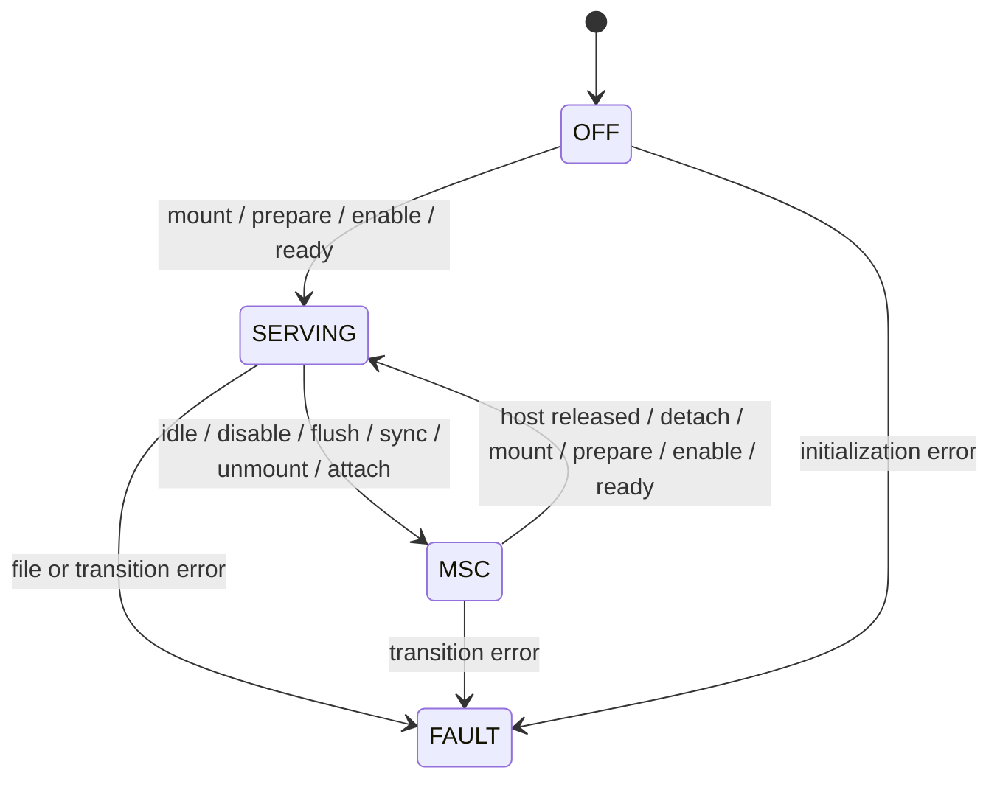

# Firmware requirements and integration

The new [portable C core](../firmware/rev2) implements storage ownership, General
Mode file-byte operations and a bounded cassette-command engine. Its callbacks
are tested with fake filesystem/card/USB implementations. No STM32 startup code,
hardware driver, SdFat integration, USB stack or OLED renderer is included yet.

The accepted target stack is official Arduino_Core_STM32 with SdFat. Follow the
user's HP21xx emulator (S15) for board integration: its current firmware uses
Adafruit TinyUSB and U8g2, with the STM32 TinyUSB port identified in its README.
Pin compatible dependency versions when adding a reproducible Arduino build.
Use the selected SSD1306 renderer here; the reference's SH1106 constructor is
for a different panel. The reference's SD uses SPI1; this design must instead
pass a dedicated SPI2 instance to SdFat because SPI1 serves the CPLD/HCT165s.

| ID | Requirement |
| --- | --- |
| FW-001 | Use SdFat on a dedicated SPI2 instance with FAT16/FAT32; verify flash/RAM use on the chosen F103 Arduino build. |
| FW-002 | In MPSI Server mode, General input reads the selected paper-tape file byte by byte; EOF returns NUL. General output and printer traffic append to selected capture files. |
| FW-003 | In MPSI Server mode, implement virtual-tape commands 0/1 forward read, 2/3 reverse read, 4 forward write, 5 stop, and 6/7 continuation. Preserve control markers separately from data bytes. |
| FW-004 | Buffer SD reads/writes. The HP handler shall not make blocking SD/filesystem calls. Acknowledge writes only after securing space in the write buffer. |
| FW-005 | Give exclusive card ownership to either local FAT or USB MSC. Reject file/tape calls in MSC and MSC blocks in serving mode. |
| FW-006 | Enter MSC at the operator's request: disable HP service, flush/close files and caches, sync the card, unmount FAT, then attach USB. The operator is responsible for avoiding an active HP transfer. |
| FW-007 | Leave MSC after host release and drained block requests: detach USB, remount/rescan FAT, invalidate old handles/caches, reinitialize the HP link, then serve. |
| FW-008 | Keep HP disabled on handover/file errors and report the failure. A failed unmount or USB drain must never lead to dual ownership. |
| FW-009 | Queue every SPI receive word qualified by a pending request, including transfers used to send responses. Treat CPLD overrun as a visible service fault. |
| FW-010 | Prioritize HP service above SD maintenance and OLED work; refresh the OLED in short chunks. |
| FW-011 | Provide SSD1306 display and debounced up/down/select buttons for role/file selection, write protection, addresses, interrupt selection, physical-tape jobs/progress and MSC. |
| FW-012 | Card removal or media errors shall stop HP service; USB shall report errors rather than successful block operations. |
| FW-013 | Read and debounce physical card detect; invalidate file/tape state on removal. Automatically reinitialize/rescan on insertion, reread capacity and revalidate paths. Remount local FAT only when local service owns the card; in MSC update raw-media state/capacity and report media change to the host. |
| FW-014 | Keep protocol-failure recovery simple: report the fault and let the operator power cycle the HP with USB unplugged. No CRC, readback or replay mechanism is required solely for this case. |
| FW-015 | Use official Arduino_Core_STM32, SdFat and the reference's STM32-compatible TinyUSB integration; keep HP service, display and filesystem ownership transitions serialized. |
| FW-016 | Store cassette images in SIMH TAP containers using an HP-aware file mapping. Preserve cassette headers/checksums and reverse/write behaviour; finalize the mapping in issue 009 before implementing the target backend. |
| FW-017 | Store configuration as simple key=value pairs in a file on FAT. Validate addresses, interrupt selection and file paths before enabling the HP link. |
| FW-018 | Dispatch by mutually exclusive application role: MPSI Server, Tape Controller or MSC. Both HP roles may own local FAT; only Server invokes the paper/printer/virtual-tape handlers. Controller uses GP directive/reply jobs through the HP MTAPE proxy, with TP/printer emulation disabled. |
| FW-019 | Provide controller jobs for reading/writing physical cassette images/files, rewind and stop, with status/progress on the three-button UI. Stream through bounded SD buffers; preserve the proxy's command/status mapping, word packing and a verified HP RAM segment limit. Match or configure the proxy's GP select code. |
| FW-020 | Distinguish HP BOF at the start of a cassette file from a SIMH tape mark terminating/separating TAP files. Define HP-file record grouping, BOF reconstruction and zero-padding preservation under issue 009. Retain HP headers, checksum bytes, reserved allocation and the empty HP EOT file; ignore TAP alignment pads and reject unsupported control values without discarding them silently. |
| FW-021 | Physical captures initially lack BOF flags. Recover markers by parsing bounded header/allocation spans, not by replacing all ordinary 0x3C values. Preserve original data and checksum bytes and report ambiguous/truncated captures; keep optional renumber/checksum/padding repair separate. |

Ownership implemented in `mpsi_storage.c`:



SERVING in the current core means locally owned FAT with server functions; it
does not implement the required Tape Controller role. Add an application-role
dispatcher and controller transport/job engine. Switching HP roles disables
service, closes/syncs files, clears pending queues and flags, selects the required
device enables and prepares the next handler before restoring service. The
operator stops HP use/controller jobs before a mode change. MSC owns no HP role
and may not run controller jobs. On host release restore the selected local role
only after media/configuration revalidation. The new role UI and target code
remain unimplemented; [the analysis](07_tape_analysis.md) traces the reference.

The operator is responsible for avoiding MSC during HP use; issue 011 is resolved
and no hardware quiesce guarantee is required. The current portable core still
returns BUSY if its best-effort HP check reports activity. That check cannot prove
the independent HP will remain idle. File/cache flushing and exclusive FAT/USB
ownership remain mandatory. Leaving MSC waits for host release before remounting.

Board callbacks must serialize transitions and USB block work in the main loop,
or provide equivalent synchronization. The portable structs are not a lock-free
ISR interface. USB handlers must defer work appropriately. `usb_host_released`
covers SCSI eject/disconnect and completion of writes; `usb_stop` drains callbacks.
The USB stack must implement capacity, 512-byte block geometry, sense errors,
cache synchronization and START STOP UNIT semantics. Rescan selected paths after
USB edits; do not retain stale FAT handles.

`hp_prepare` runs with HP_RUN low, resets queues, programs validated configuration
and stages data with flags clear. Raising HP_RUN releases the flag resets;
`hp_ready` then commits initial ACK/status. Writing ACK while HP_RUN is low cannot
initialize it. The core publishes serving mode after the ready callback succeeds.

The cassette engine has a random-access media abstraction returning OK, BUSY or
ERROR. A cache miss returns BUSY; control-marker searches examine at most 32 cells
per poll and resume at the saved position. Writes advance only after acceptance.
STOP and high-speed rewind without control mode return status with CFI clear,
following the existing server's command policy. Physical delays, STOP preemption
and ROM behaviour still need validation. The legacy server's 275..400 us
read-forward workaround remains an open timing issue.

The user chooses **SIMH TAP** for SD cassette images. This supersedes the earlier
fixed-size binary-file proposal. The cassette engine can retain its internal
16-bit cell abstraction (data in bits 7:0 and control marker in bit 8); the media
backend must translate between those cells and TAP records. That abstraction
does not require an SD file to contain bare 16-bit cells. No TAP reader/writer,
XNS converter or target cache backend exists yet. The prototype's cell backend
has a fixed capacity; a TAP backend must implement record-aware seeking and
overwrite/growth without loading an entire cassette into 20 KiB RAM.

Yes, Hilpert's supplied software uses `.t98`/XNS: the server in
[tp.c](../software/mpsiServer/tp.c) calls `XNS_Decode` and `XNS_Encode`, and the
repository includes [machine.t98](../software/machine/machine.t98). For example,
`41~83C~!` represents data 0x41 followed by control-marked 0x3C; `~` ends a token
and `!` ends the image. The legacy flag is 0x0800. The prototype cache represents
these cells as 0x0041 and 0x013C, translating that flag to bit 8. Any importer or
exporter must preserve its meaning as well as cassette headers/checksums.

[SIMH's specification](https://simh.trailing-edge.com/docs/simh_magtape.pdf)
describes byte records framed by matching little-endian 32-bit lengths, with
one padding byte when the payload length is odd. A zero marker is a tape mark.
These fields provide record structure and forward/reverse navigation, but do
not directly specify an HP9830 control flag on an arbitrary individual byte.

The subsequent [reader/writer and image analysis](07_tape_analysis.md) establishes
that BOF is the defined Beginning-of-File control byte, followed by a 12-word
header and its checksum, then one continuous content area and its checksum.
There is no separately framed data-block layer inside an HP cassette file.

The earlier BOF-to-mark experiment round-trips all 4,895 cells using three marks
and four records, but its first record contains only initial zero padding. It
therefore does not give each HP file its usual TAP-file interpretation. This
experiment is retained for analysis and superseded as a production requirement.
A natural mapping uses one HP file per TAP file, with a mark after its record(s)
and an importer-generated BOF before the HP header. Exact padding preservation,
record grouping and final mark/EOM handling remain open in issue 009.

Additional-media validation, physical overwrite timing and production
record-aware partial writes remain work. The inspection tool rejects other
control values rather than losing their flags.
Controller captures initially lose BOF flags through data-mode reading; recover
them by parsing headers/allocation spans before converting to marked TAP. The
sample contains four ordinary `0x3C` bytes, so substituting every `0x3C` is wrong.
Keep the empty final HP EOT placeholder as a file, distinct from TAP container EOF.

Configuration is accepted as simple name/value pairs on FAT. Proposed card layout
and keys (not implemented):

```text
/mpsi/config.ini
/paper/                 paper-tape/BASIC input
/tape/                  SIMH TAP cassette images
/capture/               printer and General Mode output
```

Use one `key=value` per line, for example `gp_code=8`, `tp_code=9`,
`printer_enabled=0`, `interrupt_selector=3`, `tape_write_protected=1`, and selected
input/capture/tape paths. The UI updates this file while local FAT owns the card;
MSC never accesses it through local filesystem APIs. Missing or invalid paths
are reported before their service is enabled. Following the reference UI,
append to selected capture files and offer creation of a new sequentially named
capture file; do not silently truncate an existing capture.

The status screen will show SD presence, Server/Controller/MSC/fault role, selected
files, tape write protection and controller-job progress. Select opens the menu;
up/down move the cursor;
select enters settings or chooses a file. Every submenu includes Back. Settings
cover GP code, TP code, printer enable and interrupt selector. MSC displays HP
activity detected, USB SD card active, or Waiting for host eject as appropriate. Address
changes use the same operator-managed handover and validated persistent configuration.
The Controller menu offers physical read/write, rewind and stop through the loaded
HP proxy. The existing MTAPE proxy expects GP select code 8 and uses a buffered
writer with a 6000-byte host limit. Validate the actual HP RAM/proxy layout before
writing; enable no TP/printer server handler while Controller owns GP. SD stalls
must not block controller read capture while the physical cassette keeps moving.

Initial memory target: two 4 KiB SD/tape buffers, a 1 KiB OLED framebuffer,
FAT/USB sector buffers, bounded queues and reserved stack space. This is not a
measured build size. A whole cassette image generally cannot fit in 20 KiB RAM.
A 1024-byte OLED frame at 400 kHz takes roughly 23 ms on the wire; it must not
block the HP service path. SD cache, USB and display ports remain to be written.
