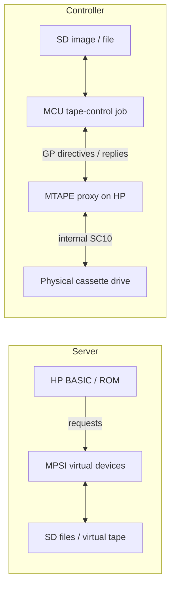

# Tape modes, BOF and the supplied images

Analysis performed 2026-10-08 against the repository and Hilpert's published
[support archive](https://madrona.ca/e/HP9830/pgm9830.tgz).
The downloaded archive SHA256 is
`9d823ae67221a177a7dbff5c175fd9141cb47649cbd219f9c04f19069442ab03`.
It contains one `.t98` image and two substantive `.f98` files. These three
images and the five inspected source/documentation files are identical to the
local copies. The `._blockscan.f98` entry is AppleDouble metadata, not another tape file.
This is one sample cassette image, not a survey of recovered media.

The application has three mutually exclusive roles:

| Role | HP-side operation | SD-side operation |
| --- | --- | --- |
| MPSI Server | HP asks for paper-tape bytes, virtual cassette operations and printer/output capture. | Serve/capture selected files and emulate a cassette image. |
| Tape Controller | The HP runs the MTAPE proxy; the MCU supplies directives through the General interface and receives real-drive status/data. The proxy accesses the physical cassette drive at SC10. | Read/save cassette images/files, or supply data for writing to physical cassette. |
| USB MSC | Every HP output is released and HP application handlers are disabled. | Host owns raw SD blocks; local FAT and both HP roles stop. |



Both HP roles use local FAT ownership, but different General-port handlers.
The current portable firmware only implements server functions. It does not
implement the MTAPE controller, a role dispatcher or a physical-tape job UI.
Controller mode needs GP enabled and TP/printer emulation disabled. HP_RUN=0
alone cannot implement that distinction, because it also disables the GP link
needed by the proxy. The VHDL update now uses select code zero to disable
GP/TP independently without responding to HP SC0. Controller GP8/TP-off/
printer-off/IRQ3 is 0x0608, verified by the bench. Firmware role/physical-job
work remains in issue 025; CPLD fitting remains in 004.

BOF means **Beginning of File**. On HP cassette it is an actual byte `0x3C`
recorded with its control bit set. The physical drive can search for it in either
direction. Data-mode reading delivers byte values without their control bits.
[Hilpert's tape description](https://madrona.ca/e/HP9830/hardware.html).
The local representation is established directly by
[Tpf_putHeader](../software/tp9830/tpf.c) and
[T98_CMD_CTLBYTE](../software/tp9830/t98.h): `0x3C | 0x0800 = 0x083C`.
Thus XNS token `83C~` denotes BOF; plain `3C~` can be ordinary data.

The image is a sequence of cells, with this structure for each cassette file:

```text
BOF | 12 header words | header checksum | content | content checksum | unused space
```

There are no separately framed data records or fixed-size data blocks within
this file format. One cassette file occupies one continuous byte sequence;
header and content are distinguished by their positions and lengths. The name
"Binary block" for file type 1 describes the contents, not an additional tape
record layer. Likewise, the writer's buffered "segments" below are transfer
units, not blocks stored in `.t98`. A complete `.t98` may contain many files.

Words are little-endian 16-bit values stored as two ordinary byte cells. Header
and content checksums are separate sums modulo 65536. The header contains file
number, used length, file type, reserved space, BASIC line numbers and common
area length; five additional header words are retained even when zero. The
content checksum follows the used contents, not necessarily the end of the
reserved allocation. Zero cells separate files. This structure comes from
[tpf.h](../software/tp9830/tpf.h) and [tpf.c](../software/tp9830/tpf.c).

This header is recorded on the actual HP cassette before each file's contents.
It is the header parsed by `Tpf_AnaHeader`, not a host-container header. Byte
offsets below are relative to the BOF cell, whose offset is 0:

| Byte offset | Size | Field | Meaning |
| --- | --- | --- | --- |
| 0 | 1 cell | BOF | Control-marked `0x3C`; `0x083C` in the XNS image. |
| 1 | 1 word | FileID / FileNum | Sequential file number. |
| 3 | 1 word | FileLength | Used content words, excluding the content checksum. |
| 5 | 1 word | FileType | 0: unused, 1: binary, 2: data, 3: BASIC; other types are listed in Hilpert's description. |
| 7 | 1 word | FileSpace | Reserved content capacity in words, excluding the checksum. |
| 9 | 1 word | FirstLine | First BASIC line number. |
| 11 | 1 word | LastLine | Last BASIC line number. |
| 13 | 1 word | CommonAreaLen | Common-area length in words. |
| 15, 17, 19, 21, 23 | 5 words | Additional header words | Zeroed by `Tpf_putHeader`; their other meanings are not established here. |
| 25 | 1 word | Header checksum | Sum of the preceding 12 header words, modulo 65536. |
| 27 | FileLength words | Contents | The used file data. |
| 27 + 2 * FileLength | 1 word | Content checksum | Sum of the used content words, modulo 65536. |
| 29 + 2 * FileLength | FileSpace - FileLength words | Unused allocation | Space reserved for a larger version of the same file. |

The header therefore occupies 24 bytes plus a 2-byte checksum, after the BOF.
The allocated file span, including BOF and both checksums, is
`29 + 2 * FileSpace` cells. Its end is calculated from FileSpace; the location
of the content checksum is calculated from FileLength. A separate end-of-file
control byte is not needed. Zero padding follows the allocation before the next
BOF. For example, file 0 below has FileLength=FileSpace=354: 708 used content
bytes and a total span of 737 cells, from BOF at 300 through cell 1036.

`.t98` is a complete cell-oriented cassette image in XNS text. `.f98` is a
single-file, word-oriented XNS representation used by the tools. They share
text syntax but must not be decoded as the same kind of tape data.

`machine.t98` is 12,639 text bytes containing 4,895 cells:

| HP file | BOF cell offset | Type / source | Used words | Reserved words | Header checksum | Content checksum |
| --- | --- | --- | --- | --- | --- | --- |
| 0 | 300 (`0x012C`) | Binary block: mbb.f98 | 354 | 354 | 02C5: valid | 672D: valid |
| 1 | 1214 (`0x04BE`) | BASIC program: blockscan.f98 | 1319 | 1319 | 0F34: valid | 2234: valid |
| 2 | 4540 (`0x11BC`) | Empty EOT placeholder | 0 | 13 | 000F: valid | 0000: valid |

Padding is 300 cells before file 0, 177 before file 1, 659 before file 2 and
300 after file 2. There are exactly three flagged `0x083C` cells and four
ordinary `0x3C` cells. Both populated contents exactly match their `.f98` sources.
The final empty file is a convention used by the tools, not a distinct EOT
control byte; [the supplied documentation](../software/tp9830/helpdoc.txt)
describes that convention. It must be retained when converting an image.

`mbb.f98` has 368 words: its first header word is `0x9830`, reserved space is
zero and its stored header checksum is zero. Those fields form an unfinished
input header, not the final cassette header. `Tpf_LoadFile` assigns the cassette
file number/space and recalculates checksums. Its 354-word contents/checksum match
the image exactly. `blockscan.f98` has 1,333 words and valid header/content sums.

The reader and writer operate differently:

1. [T98_Read](../software/tp9830/t98_mpsi.c) starts the physical drive, clears
   leader and obtains bytes through the GP proxy, saving only `sr & 0xFF`.
   A raw capture therefore contains unflagged `0x3C` at BOFs. `Tpf_Cleanup`
   reconstructs BOFs outside file allocations by walking the header's FileSpace;
   it skips the contents where ordinary `0x3C` values may occur. It can also
   renumber files, change padding and recalculate sums. The new imager must
   separate marker recovery from those optional content-changing operations.
   Preserve original header/content/checksum bytes; report ambiguous/truncated
   headers rather than blindly treating every `0x3C` as BOF.
2. `T98_Write` splits at flagged cells, leaving the BOFs out of ordinary data
   segments. It pushes segment bytes in reverse order into the HP's RAM buffer,
   then asks the proxy to perform the time-critical write and optionally create
   the next BOF. The four sample segments are 300, 913, 3325 and 354 bytes.
   Odd segments get one zero byte for the HP's word packing. The existing host
   rejects segments over 6000 bytes; the relay has no independent bound check.
   This bound is specific to the existing proxy/RAM layout, not a universal HP
   tape-file-size limit or an established STM32 performance limit.

The old reader holds the whole image in host RAM; the STM32 must stream to SD
through bounded buffers. A real cassette keeps moving during SD stalls, so the
controller's GP receive path and queue cannot wait for blocking SD writes.
Validate read capture/overflow handling separately from server emulation, where
the MCU can delay readiness before supplying the next virtual-tape byte.

The [MTAPE proxy](../software/machine/mbb.s) defines these GP directive values;
the GP ACK bit is supplied separately by the MPSI response register:

| Directive | Logical value | Effect |
| --- | --- | --- |
| Execute command | `0x0200` plus four-bit command; add `0x0080` to wait | Proxy sends the command to the real drive and returns status/read byte. |
| Push byte | `0x0400` plus byte | Push one byte onto the reverse-order HP write buffer. |
| Write buffer | `0x0800` plus options | Options 1: clear leader/write, 2: find BOF/write, 4: write next BOF. |

The reply carries eight data bits and three tape-status bits. The proxy moves
the no-cassette status to bit 8 because bit 11 is needed as the GP direction bit;
the MCU must reverse that mapping. Unlike the legacy GPIO driver, the proposed
HCT165 Q7 path delivers non-inverted captured values: do not copy the legacy
bitwise inversion. The proxy currently hard-codes GP select code 8 at
`MPSI_GPSC_INPUT`; match that setting or patch/rebuild the proxy. The MCU is
an external command source through GP; the HP remains the bus master.

HP BOF and SIMH tape marks have different positions in a logical file layout:

```text
HP cassette: padding | BOF | header + content + checksums | padding | BOF | next file ...
TAP files:   record(s) for file 0 | tape mark | record(s) for file 1 | tape mark ...
```

[SIMH's container specification](https://simh.trailing-edge.com/docs/simh_magtape.pdf)
defines matching 32-bit little-endian record lengths, odd-length alignment and
the zero tape-mark object. In the usual magtape file convention, a tape mark
terminates/separates files; a file can contain multiple records. A leading mark
is representable, but is not a BOF required before every file. Those 32-bit
lengths are TAP container framing, separate from the HP header above.

The earlier analysis substituted a TAP mark for every HP BOF and placed ordinary
byte runs in records. It proved a reversible cell-stream encoding, but not the
usual logical-file interpretation. In particular, its first record holds only
the 300 initial zero-padding cells; treating marks as file terminators would
create an extra padding-only file before HP file 0. The user's correction means
this experiment must not be treated as the accepted production mapping.

A natural logical mapping is one HP cassette file per TAP file, initially using
one data record for its header, used contents, checksums and unused allocation.
The importer would generate BOF before each HP file, while TAP marks would
terminate/separate the corresponding files. The final empty HP placeholder
remains a real header-bearing HP file even though its used length is zero.
The handling of initial/inter-file/final zero padding, exact cell preservation,
multiple records within a TAP file and the final TAP mark/EOM convention still
needs definition in issue 009. Normalizing physical padding is not an exact
cell round trip; preserving it needs an explicit layout or metadata policy.

For reference, the **superseded raw-cell experiment** produces:

```text
record(300)  mark  record(913)  mark  record(3325)  mark  record(354)
```

That is a 4,938-byte TAP container. The inspection tool verifies exact recovery
of all 4,895 cells in both directions, including all three flagged and four
ordinary `0x3C` values. Removing every control flag and recovering markers from
the parsed headers also reproduces the original sample exactly. Unknown control
values are rejected by this experimental mapping instead of silently discarded.
`--verify-tap` continues to reproduce that experiment; it does not validate a
conventional logical-file mapping or a production TAP backend.
Physical overwrite timing, large writes, bad-media recovery and further samples
still need validation; a record container does not implement those operations.

Reproduce the analysis without changing any source image:

```sh
python3 scripts/analyze_t98.py software/machine/machine.t98 software/machine/mbb.f98 software/machine/blockscan.f98 --verify-tap --json
```

The tool checks header/content sums, source-content matches, TAP forward/reverse
framing and BOF recovery for the supplied marked image. Independently, a small
host harness compiled the unchanged legacy `util.c`/`tpf.c`, listed the same three
headers without checksum errors, and used `Tpf_LoadFile` plus `Tpf_Cleanup` to
rebuild the entire 4,895-cell image exactly. No cassette hardware was operated.
